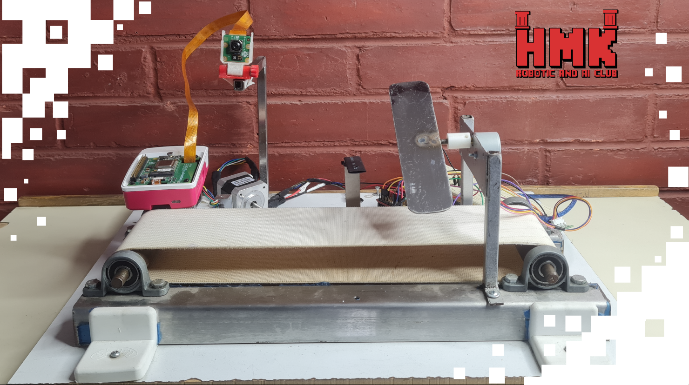

# 🎲 Path Puzzle

## 📅 Project Timeline & Context

- **Event:** FMEE 2025 – **AI & Robotics Club** Open Day
- **Date:** November 10–11–12, 2025

---
## 💡 Project Overview

An interactive vision-based puzzle where visitors are shown a **binary number** (e.g., `011`) and must convert it into its **decimal value** using a physical dice.  
A camera detects the dice using **YOLOv6 accelerated by the Raspberry Pi 5 AI Kit**, and the conveyor reacts based on whether the visitor answered correctly.

If the dice face matches the correct decimal conversion, it passes smoothly on the conveyor.  
If the answer is incorrect, a baby stepper motor activates to block the dice from moving forward.

The project combines **artificial intelligence**, **computer vision**, **robotics**, and educational logic into one engaging interactive experience.

---
### 🧩 How the Puzzle Works  
1. The system **displays a binary number** to the visitor (e.g., `011`, `101`, `110` — values from 1 to 6 in binary).  
2. The visitor must **convert the binary number into its decimal value**.  
3. They place a **standard dice** on the conveyor to submit their answer.  
4. The camera captures the dice and YOLOv6 (running on Raspberry Pi 5 with AI Kit) detects the number of circular dots.  
5. If the detected dice value matches the correct decimal result:  
   ✔️ The conveyor allows the dice to pass.  
6. If the dice value does NOT match the binary number:  
   ❌ A baby stepper motor activates, blocking the dice from moving forward.

This setup provides a hands-on way to learn binary-to-decimal conversion while interacting with AI-powered hardware.

---

## ⚙️ Components and Parts Used
- 🧠 **Raspberry Pi 5** – main controller  
- ⚡ **Raspberry Pi AI Kit (Hailo-8L NPU)** – accelerates YOLOv6 inference  
- 🎥 **Camera Module** – captures dice images on the conveyor  
- 🎲 **Standard Dice (1–6 circular dot faces)**  
- 🚚 **Mini Conveyor Belt**  
- 🔧 **Baby Stepper Motor** – blocks incorrect answers
- 🔄 **Stepper Motor / NEMA Motor** – responsible for path movement
- 🔌 **Motor Driver Module**  
- ⚙️ Wiring, connectors, and power modules  

---

## 💻 Software and Tools Used
- 🧠 **YOLOv6** – model trained for dice dot detection  
- 👁️ **OpenCV** – real-time video capture and processing  
- 🐍 **Python** – game logic, detection pipeline, and GPIO control  
- 🔧 **Raspberry Pi GPIO Libraries** – motor and conveyor control  
- ⚙️ **Hailo Runtime / AI Kit SDK** – hardware-accelerated inference  
- 🖥️ **Arduino** – for additional motor control

---

## 👨‍💻 Contributors:
Special thanks to : 
- **Ayman Bakleh** [LinkedIn](https://www.linkedin.com/in/aymanbakleh/)

---

## 🚀 Future Improvements

- Improve YOLOv6 accuracy using more dice datasets  
- Add audio or LED feedback to guide users  
- Build a GUI for showing binary values and detection results  
- Introduce multiple-dice challenges for advanced users

---

## 📸 Demo
Coming soon!  

---

Made with ❤️ using **Raspberry Pi 5**, **Raspberry Pi AI Kit**, **YOLOv6**, **Python**, and **OpenCV**.
